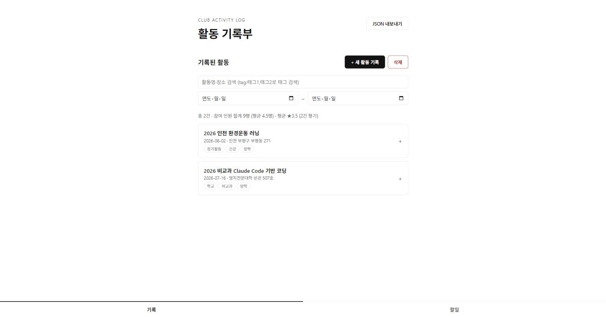
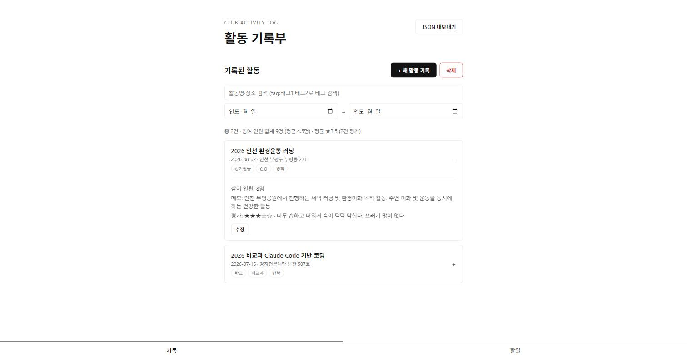
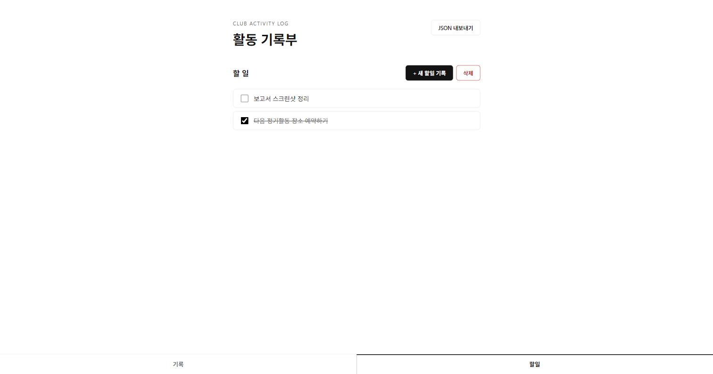

# 동아리 활동 기록 관리 웹앱

동아리 임원이 활동 내역(활동명, 날짜, 장소, 참여 인원, 메모)을 등록·조회·삭제하고,
지난 활동에 대한 평가(별점+한줄평)를 남길 수 있는 웹앱입니다.
브라우저 `localStorage`만으로 데이터를 저장하며, 별도 서버·DB 없이 동작합니다.

**바로 사용해보기**: https://parkjongbin0520-spec.github.io/hackathon-1-personal-todo-club/

## 팀원 명단과 역할

| 이름 | 역할 |
|---|---|
| 박종빈 | 기획 / 전체 구현 |

## 구현한 기능

### 필수 기능
- [x] 활동 등록 (활동명, 날짜, 장소, 참여 인원, 메모)
- [x] 활동 목록 조회 (최신순, 빈 목록 안내 문구)
- [x] 활동 삭제 (삭제 전 확인)

### 추가 기능 (자체 요청)
- [x] 활동 평가 기록 (별점 1~5 + 한줄평)
- [x] 분류 태그(다중) + `tag:태그1,태그2` 검색 문법 + 자동완성
- [x] 일괄 삭제 선택 모드 (여러 활동을 한 번에 삭제)
- [x] 등록/수정 모달 UI + Minimal White 비주얼 재스킨
- [x] 하단 탭(기록/할일) + 체크리스트형 할일 관리

### 선택 기능
- [x] 활동명·장소 키워드 검색
- [x] 기간(시작일~종료일) 필터
- [x] 활동 수정 기능
- [ ] 월별 활동 횟수 통계
- [x] 참여 인원 합계 및 평균 표시 (평점 평균도 함께 표시)
- [x] 데이터 JSON 내보내기
- [ ] 데이터 JSON 가져오기
- [x] 반응형 레이아웃 (320~430px 폭에서 검증 완료, 가로 스크롤·레이아웃 깨짐 없음)

> 진행 상황은 구현하면서 체크박스를 갱신합니다.

## 실행 방법

- **온라인으로 바로 열기**: https://parkjongbin0520-spec.github.io/hackathon-1-personal-todo-club/
- **로컬에서 실행**:
  1. 저장소를 클론합니다.
     ```bash
     git clone https://github.com/parkjongbin0520-spec/hackathon-1-personal-todo-club.git
     ```
  2. VS Code Live Server 등으로 `index.html`을 엽니다. (별도 빌드·서버 설치 불필요, `file://` 직접 열기는 지양)

## 실행 화면



"기록" 화면. 검색·기간 필터 바, 참여 인원·평점 요약, 활동 카드 리스트(태그 뱃지 포함)가 보인다.



카드를 클릭해 펼친 상태. 참여 인원, 메모, 평가(별점+한줄평), 수정 버튼이 나타난다.



"할일" 화면. 체크박스로 완료 표시(취소선)가 되는 모습.

## 기술 스택

- HTML / CSS / JavaScript (프레임워크 없음)
- 데이터 저장: 브라우저 `localStorage`
- 개발 도구: Claude Code

## 기획 참고 자료

이 프로젝트는 시장에 나와 있는 동아리/모임 관리 앱, 출결 관리 서비스, localStorage 기반 CRUD 예제를 벤치마킹해 화면 구성과 기능 우선순위를 정했습니다. 상세 내용은 [CLAUDE.md](./CLAUDE.md)의 "벤치마킹 참고" 섹션을 확인하세요.
