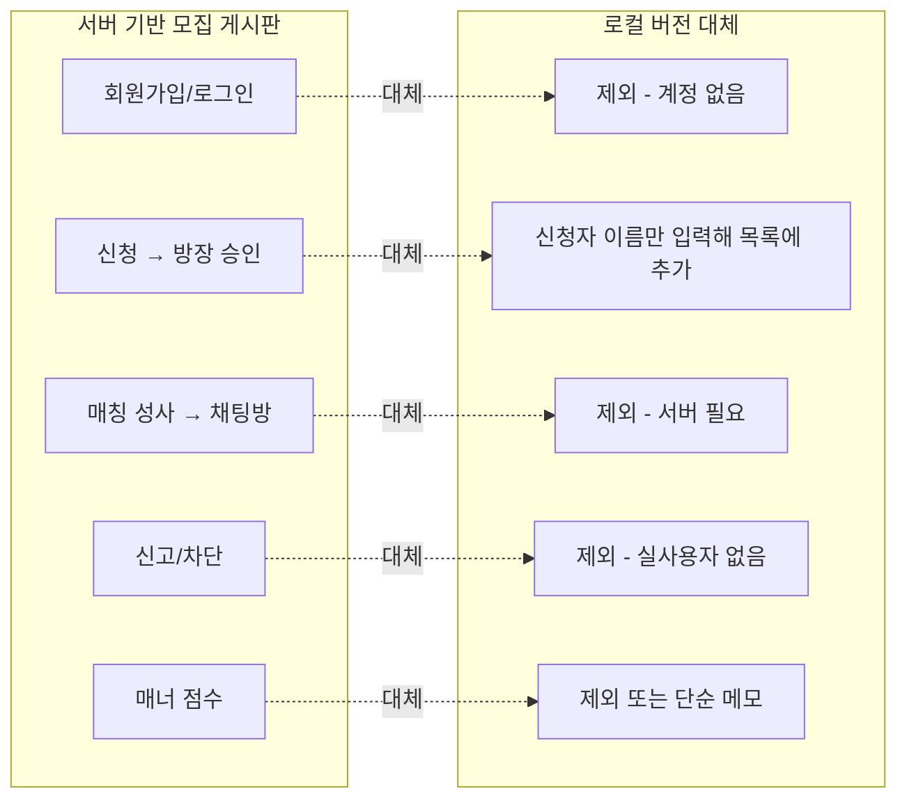
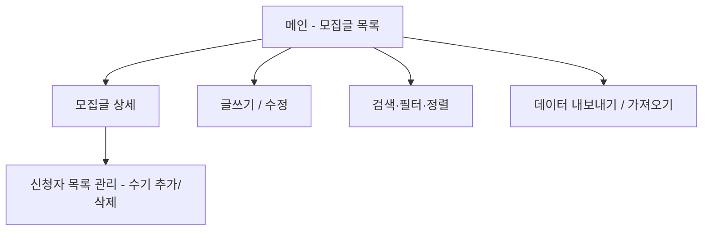

# 모집 게시판형 서비스 참고 자료 (동아리 모집 / 게임 보스 레이드 모집)

## 문서 성격

이 문서는 **당장 구현할 기능 명세가 아니라 참고 자료**다. `구현계획.md`의 "보류된 아이디어"
(동아리 찾기·가입 플랫폼)와 같은 이유로, 여러 사용자가 데이터를 공유해야 하는 "모집·매칭" 형태의
서비스는 서버·DB 없이는 본질적으로 성립하지 않는다. 다만 **동아리 모집 게시판과 게임 보스 레이드
모집 게시판은 "정원을 정해두고 인원을 모은다"는 목적과 구조가 거의 동일**해서, 나중에 이 프로젝트를
확장하거나 별도 프로젝트로 분리할 때 참고하기 위해 기능·화면 구성을 정리해 둔다.

## 전제 조건 (이번 프로젝트 제약 반영)

| 항목              | 상태  | 비고                                                                |
| --------------- | --- | ----------------------------------------------------------------- |
| 서버 / DB         | 미사용 | 로컬 브라우저 `localStorage`만 사용                                        |
| 회원가입 / 로그인 / 인증 | 제외  | 계정 개념 자체가 없음                                                      |
| 여러 사용자 간 실시간 매칭 | 불가  | localStorage는 브라우저별 독립 저장이라 "모집"의 핵심 전제(여러 사용자가 같은 글을 봄)가 성립하지 않음 |

즉 아래 내용 중 "인증이 있어야 의미 있는 기능"(신청·승인, 실시간 알림, 매너 평점 등)은
**그대로 구현할 수 없고, 어떻게 축소·대체할 수 있는지**를 함께 표시했다.

## 1. 원래(서버 기반) 모집 게시판의 필수 기능

| 분류     | 기능                              |
| ------ | ------------------------------- |
| 회원/인증  | 회원가입, 로그인, 프로필                  |
| 모집글 관리 | 등록/수정/삭제, 현재·정원 인원 표시, 마감 자동 처리 |
| 신청/매칭  | 참가 신청, 방장 승인/거절, 매칭 성사 시 채팅방 생성 |
| 검색/필터  | 카테고리·태그·정렬                      |
| 알림     | 승인/거절, 마감 임박 알림                 |
| 신뢰/안전  | 신고/차단, 매너 점수·후기                 |
| 관리자    | 신고 처리, 제재                       |

## 2. 로컬(무DB·무인증) 조건에서의 대체안

핵심은 **"신청/승인"을 인증된 사용자 간 매칭이 아니라, 한 브라우저 안에서 방장이 신청자 이름을
직접 타이핑해 목록에 추가·삭제하는 수기 관리 방식으로 축소**하는 것이다. 실제로는 오프라인/메신저로
신청을 받고, 이 앱은 "인원 현황판" 역할만 한다고 보면 된다.

## 3. 로컬 버전에서 실제로 구현 가능한 기능 목록

| 기능         | 설명                                               |
| ---------- | ------------------------------------------------ |
| 모집글 CRUD   | 제목, 모집 정원, 마감 일시, 카테고리, 내용 — localStorage 저장     |
| 인원 현황 표시   | 현재 인원 / 정원 (예: 3/5), 정원 도달 시 "모집완료" 뱃지 자동 전환     |
| 신청자 목록(수기) | 방장이 이름을 입력해 추가/삭제 — 실제 신청은 앱 밖(메신저 등)에서 이루어짐을 전제 |
| 마감 상태 처리   | 마감일시 지남 또는 정원 도달 시 상태 자동 변경                      |
| 검색/필터/정렬   | 제목 키워드, 카테고리, 마감임박순·최신순                          |
| 상태 뱃지      | 모집중 / 모집완료 / 마감                                  |
| 데이터 백업     | JSON 내보내기·가져오기 (localStorage 한계 보완용)             |

## 4. 화면 구성

| 화면        | 핵심 요소                                         |
| --------- | --------------------------------------------- |
| 메인/목록     | 모집글 카드(제목, 인원현황 n/정원, 마감 뱃지), 필터·정렬 바         |
| 모집글 상세    | 내용, 정원·현재 인원, 신청자 목록, 상태(모집중/완료/마감)           |
| 글쓰기/수정    | 제목·정원·마감일시·카테고리·내용 입력 폼                       |
| 신청자 목록 관리 | 이름 입력 후 추가, 항목별 삭제 버튼 (승인/거절 개념 없이 방장이 직접 관리) |
| 검색/필터     | 키워드, 카테고리, 정렬 옵션                              |
| 데이터 백업    | JSON 내보내기(다운로드) / 가져오기(업로드)                   |

## 5. 동아리 모집 vs 게임 보스 레이드 모집 — 필드 비교

두 도메인은 "정원을 정해 인원을 모은다"는 뼈대는 같고, 모집글에 들어가는 필드만 다르다.
즉 **모집글 데이터 구조를 도메인 종속 필드만 분리**해두면 같은 화면·로직을 재사용할 수 있다.

| 공통 필드                       | 동아리 모집 전용 필드                 | 보스 레이드 모집 전용 필드               |
| --------------------------- | ---------------------------- | ----------------------------- |
| 제목, 정원, 현재 인원, 마감일시, 상태, 내용 | 소속 학교/단체, 모집 기간, 지원 양식(자기소개) | 서버, 캐릭터/직업, 스펙 조건, 약속 시각(시간대) |

## 6. 이 프로젝트에 적용한다면

현재 데이터 모델(`{ id, title, date, place, memberCount, memo, createdAt }`)에 다음 필드를 추가하면
"활동 기록"에서 "모집 현황판"으로 성격을 확장할 수 있다 — 단, 이는 **범위 확장이므로 별도 논의 후
결정**한다 (CLAUDE.md "작업 방식": 확실하지 않은 부분은 먼저 질문).

- `capacity` (정원), `applicants` (신청자 이름 배열), `status` (모집중/완료/마감)

현재 MVP 세션 계획(Session 1~4)에는 포함하지 않고, Session 5 이후 선택 기능 논의 시 후보로만 남겨둔다.
