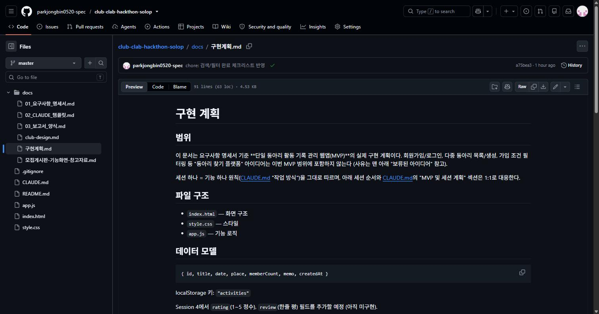

# 해커톤 결과 보고서

---

## 표지

- 팀번호 / 팀이름: 없음 / 개인화할일이동아리 (1인 진행)
- 팀원 및 역할: 박종빈 — 기획 / 전체 구현
- GitHub 저장소 URL: https://github.com/parkjongbin0520-spec/hackathon-1-personal-todo-club
- 제출일: 2026-08-05

---

## 1. 문제 정의와 기획

- 이 웹앱이 해결하려는 문제: 동아리 활동 내역이 메신저 대화나 개인 메모에 흩어져 있어, 지난 활동을 다시 찾아보거나 참여 인원·평가를 한눈에 파악하기 어렵다는 문제를 해결한다.
- 주 사용자와 사용 상황: 동아리 임원(총무·회장)이 활동이 끝난 직후 그 자리에서 짧게 기록하고, 다음 모임을 준비할 때 지난 기록을 검색·참고하는 상황을 가정했다.
- 구현한 필수 기능 3가지: ① 활동 등록(활동명·날짜·장소·참여 인원·메모) ② 활동 목록 조회(최신순 정렬, 빈 목록 안내 문구) ③ 활동 삭제(삭제 전 확인 절차)
- 구현한 선택 기능과 선택한 이유: 활동명·장소 키워드 검색과 기간 필터(지난 기록을 빠르게 찾기 위함), 활동 수정(잘못 기록해도 다시 만들 필요 없게), 참여 인원 합계·평균 및 평점 평균 요약(전체 현황을 숫자로 한눈에), 데이터 JSON 내보내기(localStorage만 쓰는 한계를 백업으로 보완), 반응형 레이아웃(활동 직후 휴대폰으로 바로 기록). 이 외에 개발 중 평가(별점+한줄평), 분류 태그+태그 검색, 할일 체크리스트, 일괄 삭제, 등록/수정 모달, 전면 비주얼 재스킨을 사용자 요청으로 추가했다.

## 2. 설계

- 화면 구성 설명 또는 간단한 화면 스케치: 상단 헤더(제목 + JSON 내보내기 버튼) 아래에 "기록"·"할일" 두 화면을 하단 고정 탭바로 전환한다. "기록" 화면은 등록/일괄삭제 버튼 → 검색·기간 필터 바 → 참여인원·평점 요약 → 활동 카드 리스트(클릭 시 그 자리에서 펼쳐짐) 순으로 배치했다. "할일" 화면은 등록/일괄삭제 버튼과 체크박스형 목록으로 구성했다. 활동 등록·수정은 `<dialog>` 모달 하나를 재사용한다.
- 데이터 구조 (저장 형태와 필드 설명): `activities`(키: `"activities"`) → `{ id, title, date, place, tags: string[], memberCount, memo, rating(0~5), review, createdAt }`. `todos`(키: `"todos"`) → `{ id, text, done, createdAt }`.
- 파일 구조: `index.html`(화면 구조), `style.css`(스타일), `app.js`(기능 로직) 3개 파일로 구성했다. 프레임워크·빌드 도구 없이 순수 HTML/CSS/JS만 사용했다.

## 3. Claude Code 활용 과정

### 3-1. 작성한 CLAUDE.md

- 어떤 규칙을 넣었고, 왜 그 규칙이 필요하다고 판단했는지: 코딩 규칙(camelCase, 함수 위 한 줄 한글 주석, 함수 하나는 일 하나, 2칸 들여쓰기), 작업 방식(코드 작성 전 계획 먼저 제안, 한 세션에 기능 하나만, 기존 코드 임의 수정 금지, 불확실하면 질문), 하지 말 것(서버·DB·빌드 도구 금지, 요청 없는 파일 생성 금지, 더미 데이터 대량 생성 금지, 100줄 넘는 코드 한 번에 출력 금지), 커밋 규칙(기능 하나가 동작하면 바로 커밋, `<기능명>: <내용>` 형식)을 넣었다. 이 프로젝트는 하루가 아니라 여러 세션에 걸쳐 진행되는 구조라, 세션마다 계획을 먼저 말하게 하고 기능 단위로 쪼개두지 않으면 방향을 잃기 쉽다고 판단했다. 100줄 제한은 한 번에 큰 diff가 나오면 검토가 힘들어지는 걸 막기 위함이었다.
- 작업 도중 규칙을 수정했다면 무엇을 왜 바꿨는지: 처음엔 Session 1~5로 순서가 고정돼 있었는데, 사용자가 "평가 기능"을 요청하면서 Session 4로 새로 끼워 넣고 이후 번호를 한 칸씩 밀었다. 데이터 구조도 처음엔 `rating`/`review`가 "미구현 예정"으로만 적혀 있다가 실제 구현 후 갱신을 놓쳐 한동안 실제 코드와 어긋나 있었던 걸 뒤늦게 발견해 바로잡았다(3-5 오류 사례와 별개로, CLAUDE.md 자체 점검 요청 때 발견). "벤치마킹 참고" 섹션도 Minimal White 재스킨과 모달 전환 이후 실제 UI와 완전히 달라져서, 이름을 "UI/UX 결정 사항"으로 바꾸고 내용을 전면 재작성했다.

### 3-2. 구현 전 계획

- 구현 시작 전 세운 계획 화면 캡처를 첨부: (GitHub에 커밋된 `docs/구현계획.md`)
- 실제 작업이 계획과 달라진 부분: 원래 계획은 Session 1(등록)→2(조회)→3(삭제·검증)→4(MVP 정리·배포)→5(선택 기능: 검색·통계·수정·내보내기·반응형) 순서였다. 실제로는 매 세션이 끝날 때마다 새 요구가 붙으면서 크게 벗어났다: "수정" 기능이 검색보다 먼저 요청돼 순서가 바뀌었고, 계획에 없던 평가(별점+한줄평), 분류 태그+`tag:` 검색 문법, 등록/수정 모달 전환, Minimal White 전면 재스킨, 일괄 삭제 선택 모드, 할일 체크리스트 탭이 대화 중 즉석 요청으로 추가됐다.

### 3-3. 핵심 프롬프트 3건

**프롬프트 1 — 첫 구현 세션 시작**

| 구분              | 내용                                                                                                                                           |
| --------------- | -------------------------------------------------------------------------------------------------------------------------------------------- |
| 무엇을 요청했나        | "세션 1 시작해줘."                                                                                                                                 |
| 어떤 결과를 받았나      | 등록 폼(활동명·날짜·장소·참여인원·메모)과 localStorage 저장 로직(`generateId`, `saveActivity`, `handleSubmit`)을 구현하고, Live Server로 로컬 서버를 띄워 devtools로 저장 확인까지 마침 |
| 만족스러웠는지, 아니라면 왜 | 만족. 이후 "필수적으로 채워야하는 칸이 비어있으면 등록할 수 없다고 알려주면 좋겠어"라는 후속 요청만 추가로 반영                                                                             |

**프롬프트 2 — 비주얼 재스킨과 모달 전환**

| 구분              | 내용                                                                                                                                                                                                                               |
| --------------- | -------------------------------------------------------------------------------------------------------------------------------------------------------------------------------------------------------------------------------- |
| 무엇을 요청했나        | "비주얼을 변경하는 게 좋을 것 같아. UIUX 개선을 club-design.md에서 차용한다. 카드 클릭하면 상세 페이지로 가는게 아니라 카드가 확장하는 형태로 진행하는건 어떨까? 그리고 게시물을 생성할 때 다른 페이지로 이동하지 않아도되는 모달로 해결이 가능할지 알려줘. 수정도 모달창에서 하면 좋을 것 같아. 썸네일 이미지는 없는게 좋을 것 같아. 이미지 없는 텍스트 카드 구조를 계속가져가자." |
| 어떤 결과를 받았나      | 색상·타이포를 Minimal White 톤(흰 배경/검정 산세리프/골드 별점 포인트)으로 전면 재스킨하고, 등록·수정 폼을 `<dialog>` 모달로 전환. 카드 클릭 시 상세 페이지 이동 없이 그 자리에서 펼쳐지는 기존 아코디언 구조는 그대로 유지                                                                                      |
| 만족스러웠는지, 아니라면 왜 | 만족. 이어서 삭제 방식과 평가 편집 위치에 대한 추가 개선 요청으로 이어짐                                                                                                                                                                                       |

**프롬프트 3 — 태그 자동완성 문의**

| 구분              | 내용                                                                                                  |
| --------------- | --------------------------------------------------------------------------------------------------- |
| 무엇을 요청했나        | "혹시 검색창에서 'tag:' 입력했을 때 검색 가능한 목록이 나오도록하는 건 안되는거야?"                                                 |
| 어떤 결과를 받았나      | 네이티브 `<datalist>`를 검색창에 연결하고, 입력값을 실시간으로 분석해 이미 조합 중인 태그를 이어서 자동완성하는 로직(`updateTagSuggestions`)을 구현 |
| 만족스러웠는지, 아니라면 왜 | 만족. 다만 여러 태그를 조합할 때의 표시 형식은 이후 3-4 사례처럼 한 번 더 개선을 거침                                                |

### 3-4. 프롬프트 개선 사례 1건

- 처음 요청한 내용: "그리고 태그 검색 기능이 필요한데 게시물에서 태그를 생성하거나 기존에 사용되던 태그를 검색하는 방법을 'tag:학교 tag:비교과' 이런 방식으로 하면 좋을 것 같다." 이 요청 그대로 태그마다 `tag:`를 반복하는 문법으로 구현했다.
- 결과가 기대와 달랐던 지점: 구현 후 사용자가 "뭔가 시각적으로 불편하다. 여러개의 태그를 입력했을 때 tag:@@ tag:@@ 형태가 아니라 tag:@@만 나오게 할 수 없는가?"라고 지적했다. 태그가 늘어날수록 `tag:`가 반복돼 검색창이 지저분해 보이는 문제였다.
- 요청을 어떻게 고쳤는지: 검색 문법을 `tag:태그1,태그2`처럼 `tag:` 하나에 콤마로 여러 태그를 묶는 방식으로 바꿨다. `parseSearchQuery`가 `tag:(\S+)`로 매치한 뒤 콤마로 분리해 태그 배열을 만들도록 수정하고, 자동완성(`updateTagSuggestions`)도 마지막 콤마 이후 부분만 다음 태그 후보로 이어 붙이도록 다시 짰다.
- 고친 뒤 무엇이 달라졌는지: 검색창엔 `tag:학교,비교과`처럼 태그 그룹이 하나로 묶여 보이고, `tag:학교,`까지 입력하면 이미 쓴 "학교"는 자동완성 후보에서 빠지고 나머지 태그만 이어서 제안되도록 개선됐다.

### 3-5. 오류 해결 사례 1건

- 발생한 오류 (메시지 또는 증상): 반응형 레이아웃을 검증하려고 Claude in Chrome의 `resize_window`로 브라우저 창을 375×812로 줄였는데, `window.innerWidth`를 확인해보니 501이 나왔다. 427로 더 줄여도 여전히 501이었다.
- 원인 파악 과정: 800×850으로 다시 요청해보니 실제로 786까지 줄어드는 것을 확인했다. 즉 큰 폭에서는 리사이즈가 정상 동작하지만, 특정 값(약 500px) 밑으로는 줄어들지 않는다는 걸 여러 폭으로 재시도하며 알아냈다. Chrome이 강제하는 최소 창 폭 제한에 걸린 것으로 판단했다.
- 해결 방법: 브라우저 창 자체를 줄이는 대신, 현재 페이지의 `body`를 비우고 그 안에 `iframe` 3개(320px/375px/430px)를 나란히 주입해서 각 iframe이 독립적인 CSS 뷰포트로 렌더링되게 했다. 이렇게 하면 창 크기 제한과 무관하게 실제 좁은 화면 렌더링을 정확히 스크린샷으로 확인할 수 있었다.
- 이 과정에서 배운 점: 브라우저 "창" 크기와 실제 "뷰포트(CSS px)" 크기는 다를 수 있고, OS·브라우저가 강제하는 최소 윈도우 크기 때문에 창 리사이즈만으로는 작은 화면을 재현하지 못할 수 있다는 것을 배웠다. 이런 경우 `iframe`으로 원하는 폭을 직접 만들어주는 우회가 안정적이었다.

## 4. 실행 결과

- 주요 화면 스크린샷 2장 이상과 각 화면 설명:
  
  
  
  "기록" 화면. 검색·기간 필터 바, 참여 인원·평점 요약, 활동 카드 리스트(태그 뱃지 포함)가 보인다.

  

  카드를 클릭해 펼친 상태. 참여 인원, 메모, 평가(별점+한줄평), 수정 버튼이 나타난다.

  

  "할일" 화면. 체크박스로 완료 표시(취소선)가 되는 모습.

- 테스트한 항목과 결과 (정상 동작 확인 내역): 활동 등록·조회·삭제(확인 절차 포함), 입력값 검증(활동명 필수/미래 날짜 금지/참여 인원 1 이상), 평가(별점+한줄평, 모달에서 편집), 수정(모달 재사용, 기존 값 유지), 검색·기간 필터, 분류 태그와 `tag:` 검색·자동완성, 참여 인원·평점 요약, 일괄 삭제 선택 모드(기록·할일 공통), 할일 체크리스트, JSON 내보내기(활동+할일 통합), GitHub Pages 배포, 반응형 레이아웃(320~430px)까지 모두 정상 동작을 확인했다. 같은 네트워크의 다른 기기(폰)로 접속하는 안내는 제공했으나 실기기 접속 테스트는 아직 완료하지 못했다.

## 5. 한계와 개선 방향

- 시간 내 구현하지 못한 것: 데이터 JSON 가져오기(내보내기만 구현), 월별 활동 횟수 통계, 실제 다른 기기(폰)로의 접속 테스트.
- 현재 코드의 문제점이나 불안한 부분: `localStorage`는 기기·브라우저별로 독립 저장되기 때문에 여러 기기 간 데이터가 동기화되지 않는다(문서화는 해뒀지만 실사용자 입장에선 혼란 요소가 될 수 있다). Minimal White 재스킨 때 `style.css`를 한 번에 400줄 넘게 새로 써서, CLAUDE.md 자체 규칙("100줄 넘는 코드를 한 번에 출력하지 않기")을 스스로 어긴 사례가 있었다. 할일 항목엔 태그·마감일이 없어 활동 기록만큼 정교하지 않다.
- 시간이 더 있었다면 무엇을 했을지: JSON 가져오기까지 구현해 내보내기/가져오기 백업·복원 루프를 완성하고, 월별 통계를 추가하고, 참고 자료로만 남겨둔 "모집 게시판형"(정원·마감 상태) 아이디어를 별도 확장으로 검토해봤을 것 같다.

## 6. 역할 분담과 소감

- 팀원별 담당 업무: 박종빈 — 기획, 설계, 전체 구현, 테스트를 단독으로 진행 (1인 팀).
- AI를 활용한 개발에 대해 느낀 점 (팀원별 한두 문장씩): superpowers 플러그인의 역할이 브레인스토밍을 통한 기획 단계에서 지정하지 않을 수 있는 기능을 명시해주어서 설계에 도움이 되었고 서브 에이전트를 사용했기 때문에 다른 작업도 동시에 할 수 있었다. MCP 같은 에이전트 도구 활용이 부족한 것 같아서 AI가 만든티가 많이 나는 것 같다. 특별한 독창성이 떨어지는 점도 있었다.
